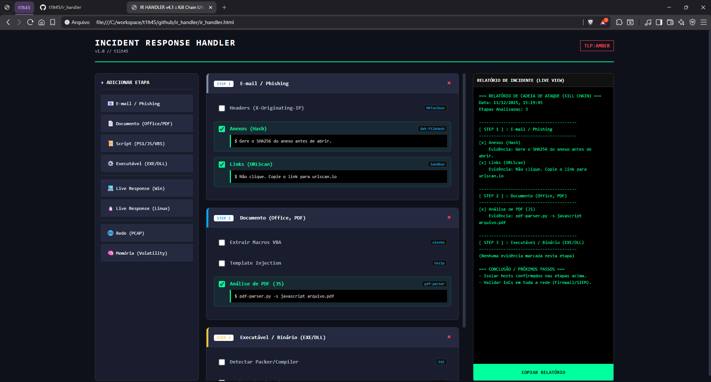

# 🛡️ IR Handler (Incident Response Toolkit)

> **Kill Chain Edition**

Uma ferramenta **Client-Side (HTML/JS)** projetada para auxiliar Analistas de SOC, CSIRT e Blue Teamers a estruturar o fluxo de pensamento (*Mindset*) durante a análise de incidentes de segurança.


---

## 📸 Preview




---

## 🎯 Objetivo

Em momentos de crise e estresse (Incident Response), o analistas pode sofrer de "paralisia por análise" ou esqueça etapas básicas de triagem se deparando com o cenário à frente.

O **IR Handler** atua como um **Checklist Interativo e Dinâmico**, fornecendo:
1.  **Mindset Estruturado:** Um fluxo lógico de investigação.
2.  **Kill Chain Tracking:** Capacidade de encadear eventos (Ex: Phishing -> Download -> Execução -> C2).
3.  **Comandos Prontos:** Sintaxe exata para ferramentas de mercado (Wireshark, Volatility, Olevba, etc.), economizando tempo de pesquisa.
4.  **Relatório Automático:** Geração de um log técnico em tempo real pronto para ser anexado ao ticket do incidente.

## 🚀 Funcionalidades (v1.0)

* **Timeline Cumulativa:** Adicione múltiplas etapas de análise sem perder o histórico anterior.
* **Relatório Live:** O relatório final é construído dinamicamente conforme você marca os checkboxes.
* **Zero Dependências:** Funciona em qualquer navegador moderno (Brave, Chrome, Firefox, Edge). Não requer Backend, Python ou Banco de Dados.
* **Modo "Dark":** Interface visual focada em ergonomia para ambientes com pouca luz, para não ferir o olho do analista, sendo que já é impactada diariamente com luzes das máquinas.

## 🛠️ Artefatos Suportados

A ferramenta cobre as principais categorias de análise forense:

| Categoria | Ferramentas Sugeridas | Descrição |
| :--- | :--- | :--- |
| **📧 Phishing / E-mail** | `MXToolbox`, `URLScan` | Análise de Headers, SPF/DKIM e Links. |
| **📄 Documentos** | `olevba`, `pdf-parser` | Análise de Macros Maliciosas e PDF Exploits. |
| **📜 Scripts** | `CyberChef`, `Grep` | Desofuscação de PowerShell, Bash, VBS e JS. |
| **⚙️ Executáveis** | `PEStudio`, `Capa`, `Floss` | Análise Estática de Binários (Malware Analysis). |
| **🌐 Rede (PCAP)** | `Wireshark`, `TShark` | Detecção de Beacons, C2 e Exfiltração. |
| **🧠 Memória** | `Volatility 3` | Análise de processos ocultos e injeção de código. |
| **💻 Live Response** | `Sysinternals`, `Linux Cmds` | Triagem rápida em Windows e Linux (Web). |

## 📦 Instalação e Uso

1.  **Clone o repositório:**
    ```bash
    git clone [https://github.com/t1lt45/ir_handler.git](https://github.com/t1lt45/ir_handler.git)
    ```
2.  **Execute:**
    * Basta abrir o arquivo `index.html` (ou `ir_handlerhtml`) no seu navegador preferido.
3.  **Fluxo de Trabalho:**
    * Selecione o tipo de artefato no menu lateral.
    * Siga o checklist sugerido.
    * Copie os comandos sugeridos para seu terminal de análise.
    * Ao final, clique em **"Copiar Relatório"** e cole no seu chamado/ticket.

## 🤝 Contribuição

Sugestões de novos comandos, ferramentas ou fluxos de análise são bem-vindas! Sinta-se à vontade para abrir uma *Issue* ou enviar um *Pull Request*.

## ⚠️ Disclaimer

Esta ferramenta é destinada para **uso defensivo** e educacional. O autor não se responsabiliza pelo uso indevido das informações ou ferramentas aqui referenciadas.

---
Desenvolvido por **[// t1lt45 // "e o amiguinho IA 😉"]** 💀